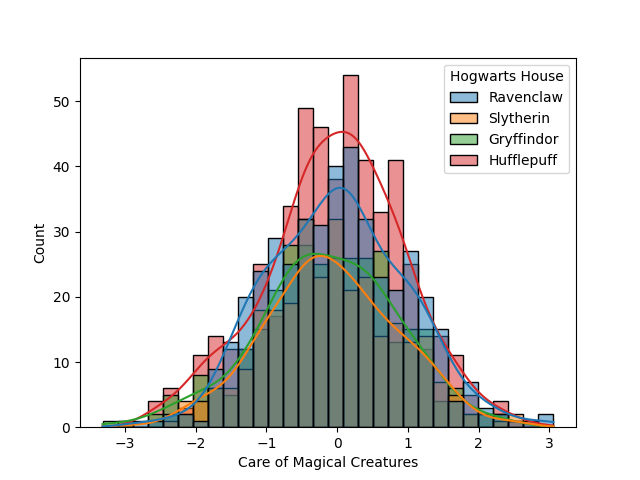
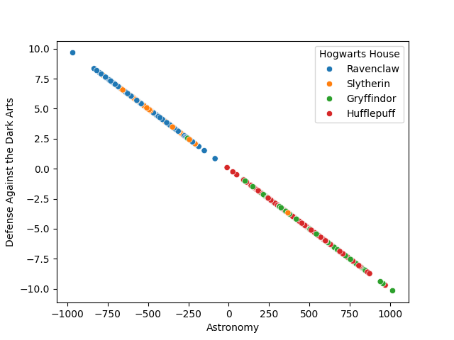
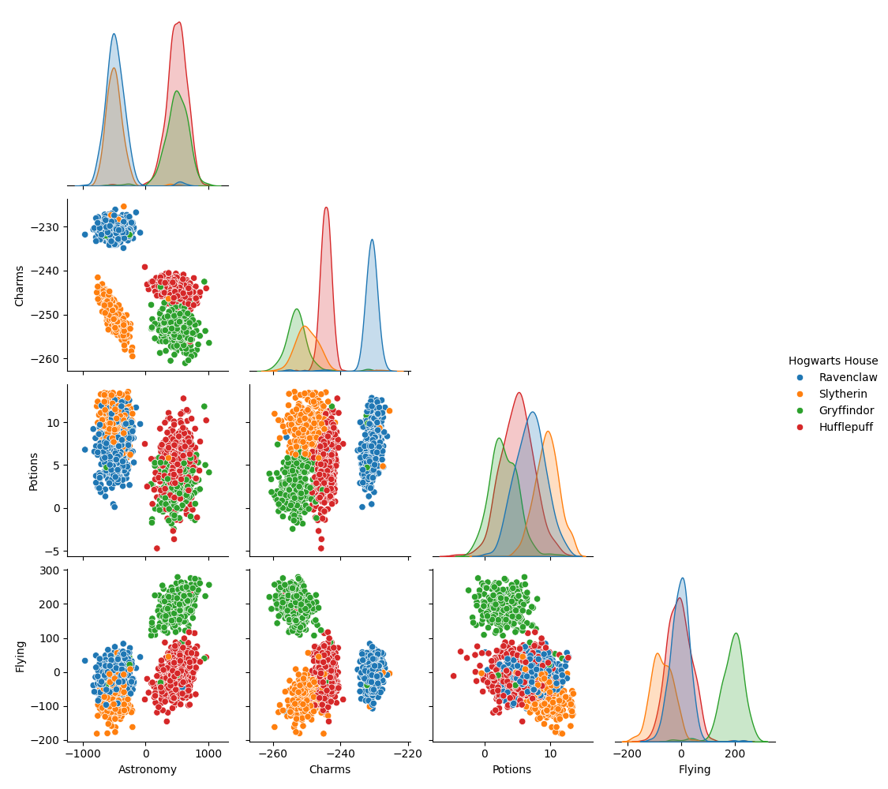

# DSLR - Data Science and Logistic Regression

A machine learning project that classifies Hogwarts students into their houses using logistic regression. Built from scratch without using sklearn's logistic regression.

## Overview

This project implements a **one-vs-all multiclass logistic regression classifier** to predict which Hogwarts house a student belongs to based on their course grades.

## Features

- Custom statistical analysis tool (replicating pandas `describe()`)
- Data visualization (histogram, scatter plot, pair plot)
- Logistic regression with gradient descent
- One-vs-all classification for 4 houses

## Installation

```bash
make install
```

## Usage

```bash
# Run full pipeline
make all

# Or step by step:
make describe   # Show dataset statistics
make train      # Train the model
make predict    # Predict on test data
make plots      # Generate visualizations
```

## Project Structure

```
dslr/
├── describe.py              # Statistical analysis tool
├── logreg/
│   ├── logreg_train.py      # Training script
│   └── logreg_predict.py    # Prediction script
├── plots/
│   ├── histogram.py         # Histogram visualization
│   ├── scatter_plot.py      # Scatter plot visualization
│   └── pair_plot.py         # Pair plot visualization
├── utils/
│   ├── preprocessing.py     # Data cleaning, scaling, encoding
│   └── statistics.py        # Custom stats functions
├── datasets/
│   ├── dataset_train.csv    # Training data
│   └── dataset_test.csv     # Test data
├── output/                  # Generated outputs
│   ├── histogram.png
│   ├── scatter_plot.png
│   ├── pair_plot.png
│   └── houses.csv
└── weights.npy              # Trained model (generated)
```

## Data Visualization

### Histogram

Shows the distribution of **"Care of Magical Creatures"** scores across all four Hogwarts houses. This feature has a homogeneous distribution, meaning it's not useful for distinguishing between houses.



### Scatter Plot

Displays the relationship between **Astronomy** and **Defense Against the Dark Arts**. These two features are highly correlated (almost perfectly linear), indicating redundancy.



### Pair Plot

A comprehensive view of relationships between selected features (**Astronomy**, **Charms**, **Potions**, **Flying**) colored by house. Helps identify which features best separate the classes.



## How It Works

### 1. Data Preprocessing
- Select relevant numeric features
- Fill missing values with column mean
- Normalize features using z-score standardization

### 2. Training (One-vs-All)
- Train 4 binary classifiers (one per house)
- Use sigmoid activation and gradient descent
- Save weights for prediction

### 3. Prediction
- Load trained weights
- Compute probability for each house
- Assign the house with highest probability

## Output

After running `make predict`, the file `output/houses.csv` contains:

| Index | Hogwarts House |
|-------|----------------|
| 0     | Ravenclaw      |
| 1     | Slytherin      |
| ...   | ...            |

## Clean Up

```bash
make clean  # Remove venv and generated files
```